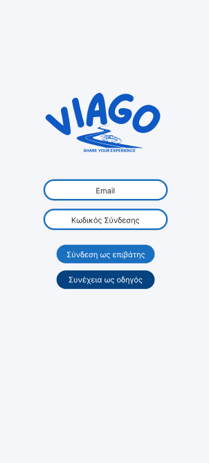
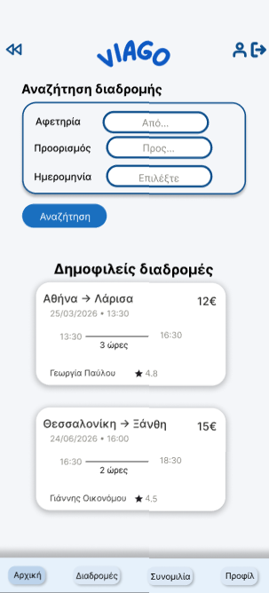
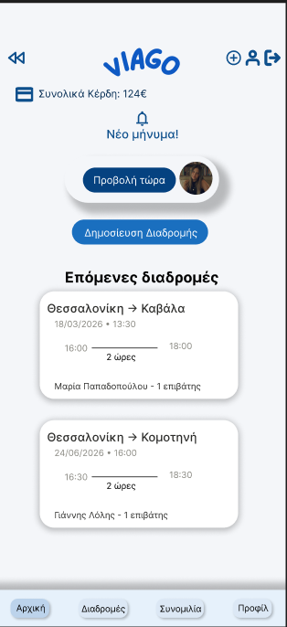
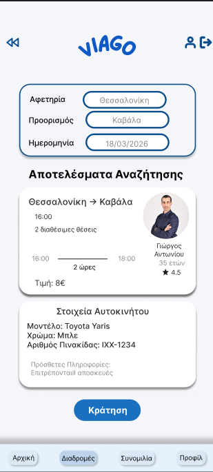
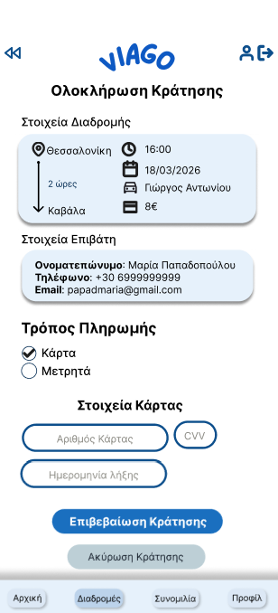
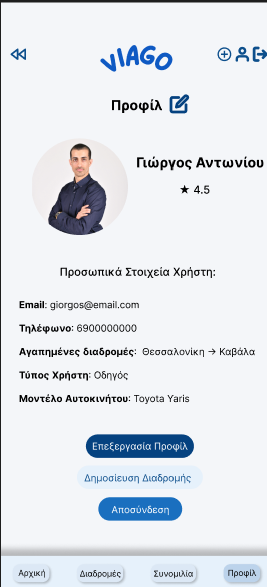
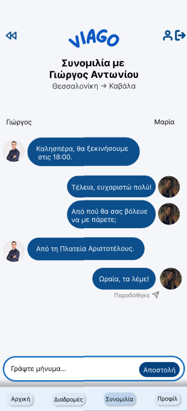

# ViaGo – Ride Sharing Mobile Application

## Overview
ViaGo is a greek mobile ride-sharing application designed in Figma. The project was developed as part of a UX/UI Design assignment and includes the complete design process from low-fidelity wireframes to a high-fidelity interactive prototype.

## Figma Wireframes
[Figma Wireframes](https://www.figma.com/design/Ut4GK9oKDez5rttil8JjIZ/Project-iis25104---High-Fidelity?node-id=0-1&t=LvtuCg4bziyyqwAg-1)

## Figma Design System
[Design System](https://www.figma.com/design/Ut4GK9oKDez5rttil8JjIZ/Project-iis25104---High-Fidelity?node-id=49-2&t=LvtuCg4bziyyqwAg-1)

## Figma Navigation Flow Diagram
[Navigation Flow Diagram](https://www.figma.com/design/Ut4GK9oKDez5rttil8JjIZ/Project-iis25104---High-Fidelity?node-id=23-279&t=LvtuCg4bziyyqwAg-1)

## Features
- User authentication
- Ride search and booking
- Driver profile management
- Ride publishing
- In-app messaging
- Multiple payment methods
- Accessibility considerations

## Design Process
- User Research
- Personas
- Low-Fidelity Wireframes
- High-Fidelity Prototype
- Design System
- Accessibility Evaluation
- User Flows

## Screenshots of some screens

### Login Screen

### Passenger Home Screen

### Driver Home Screen

### Search Results

### Booking Screen

### Profile Screen

### Chat Screen

## Tools Used
- Figma
- WebAIM Contrast Checker

## Author
Despoina Karatza
